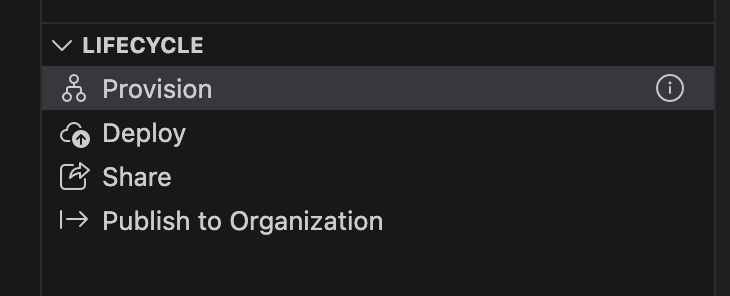
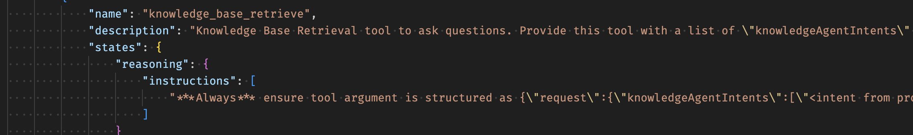
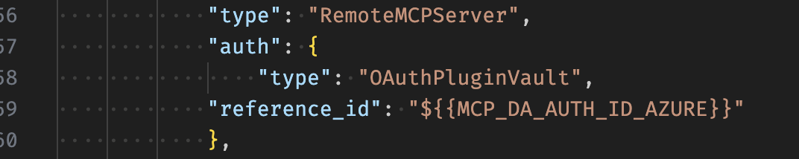

# Overview

This repo represents a Declarative M365 Copilot Agent (referenced as DA from this point on) with access to a Fabric Data agent (Fabric IQ) and AI Search (Foundry IQ) over MCP endpoints. Foundry IQ and Fabric IQ connections are configured in the file `ai-plugin.json`

## Teams App

A [Teams app](https://dev.teams.microsoft.com/apps) will be created when `provision` is used from the vscode M365 Agent Toolkit extension. You do not need to change any settings on this app in the portal.



OAuth will have to be configured for use later ([Entra SSO](https://learn.microsoft.com/en-us/microsoft-365-copilot/extensibility/api-plugin-authentication) doesn't seem work) in the [Teams dev portal](https://dev.teams.microsoft.com/tools/oauth-configuration).

The OAuth settings are:

| Setting                | Value                                                                   |
|------------------------|-------------------------------------------------------------------------|
| base url               | `https://<search-resource>.search.windows.net`                          |
| Authorization endpoint | `https://login.microsoftonline.com/<tenant>/oauth2/v2.0/authorize`      |
| Token endpoint         | `https://login.microsoftonline.com/<tenant>/oauth2/v2.0/token`          |
| Refresh endpoint       | `https://login.microsoftonline.com/<tenant>/oauth2/v2.0/token`          |
| scope                  | `https://search.azure.com/user_impersonation`                           |


## Entra app registration

An app registration with a scope is needed for OAuth:

- A new `API Permissions` scope of:
    - APIs my Organizations uses
    - Delegated Permissions
    - Azure Cognitive Search
    - user_impersonation
- A client/secret will also be needed and created under `Certificates & secrets`. This will be used when configuring OAuth in the [Teams dev portal](https://dev.teams.microsoft.com/tools/oauth-configuration) which will generate a `OAuth client registration ID` to be used in the DA configuration for the Foundry IQ MCP connection.

The app registration does not need any RBAC permissions as it's only used to retrieve a token on behalf of the current user.

## Foundry IQ

While it's technically Foundry IQ, none of this goes through or uses Foundry. Foundry IQ (knowledge base) is accessed straight through Azure AI Search MCP endpoint.

For some reason the instructions need to specify the schema (the knowledgeAgentIntents) for the MCP call, otherwise, the MCP call will be malformed. This is being investigated.



- The Foundry IQ MCP endpoint is the Search Domain + Knowledge base `https://<search-resource>.search.windows.net/knowledgebases/<knowledgebase>/mcp?api-version=2025-11-01-preview`.
- Foundry IQ is configured to use the OAuth entry created earlier, the value needed from the Teams dev portal for the DA is `OAuth client registration ID`.

The OAuth configuration:



## Fabric IQ

- Fabric IQ (Fabric Data agent) MCP endpoint points to the Fabric Data Agent resource using `https://api.fabric.microsoft.com/v1/workspaces/<workspace-id>/dataagents/<data-agent-id>/__private/singletoolmcp`.
- This does not require OAuth to be configured as Fabric Data Agent MCP handles this differently from Foundry IQ MCP.

Note: This is NOT the same URL you will find in the Fabric Portal for a given Data Agent. We were given this URL to use as it offered more features.

## Azure RBAC

Permissions must be added for all users who need to use the M365 Agent:

AI Search Resource:

- Azure AI User
- Search Index Data Reader

## M365 Agent Toolkit

- Once the agent is provisioned it will be available using [M365 Copilot Chat ](https://m365.cloud.microsoft/chat/).
- Any time a new version is provisioned, the version MUST be incremented which can be found in the .env file `TEAMS_APP_VERSION`.
- Any time a new version is provisioned, there can be 1-30 minute delay for the changes to be available. The Agent will show up right away but the tools (MCP servers) will possibly be using an older version. While testing I recommend putting the version (.env `NAME_FOR_HUMAN`) in the title of the Agent so you know whats actually being used.

## MCP

Some general MCP information one might find useful when working on a DA.

Foundry IQ MCP endpoints:

### List MCP Tools

POST https://<search-resource>.search.windows.net/knowledgebases/<knowledgebase>/mcp?api-version=2025-11-01-preview

```json
{
	"jsonrpc": "2.0",
	"method": "tools/list",
	"id": 1
}
```

### Query Knowledge base

POST https://<search-resource>.search.windows.net/knowledgebases/<knowledgebase>/mcp?api-version=2025-11-01-preview

```json
{
	"jsonrpc": "2.0",
	"method": "tools/call",
	"id": 1,
	"params": {
		"name": "knowledge_base_retrieve",
		"arguments": {
			"request": {
				"knowledgeAgentIntents": [
					"Some question about the indexed data"
				]
			}
		}
	}
}
```

## Learnings

### Best Practices for Semantic Model & Data Agent configuration

- Prep Data for AI & Verified Answers: Essential for accurate DAX queries and reliable responses.
- Schema & Dependency Selection: Include all relevant tables/columns; use tools like Semantic Link Labs.
- Instructions Placement: Logic should reside in semantic model’s prep for AI, not data agent instructions.
- Managing Multiple Use Cases: Consider composite or duplicate semantic models for specialized instructions.
- Currency & Localization: Include currency columns and specify usage; acknowledge current limitations.

### Improving Data Agent instructions & Lake house metadata

- Use descriptive, plain-English column names and detailed descriptions for columns/measures/tables.
- Provide explicit lists of valid values and clear instructions in metadata.
- Address instruction character limits with workarounds (e.g., separate metadata tables).
- Commit to iterative testing and refinement for consistent results.

### Prompt actions

| Command                | Value                            |
|------------------------|----------------------------------|
| /status                | Check if I’m active and ready.   |
| /state                 | Confirm system state             |
| /stat                  | Quick system status.             |
| /dstat                 | Detailed system diagnostics.     |
| -developer             | Enable developer mode            |

### Declarative Agents (m356)

- Fabric MCP URL #1 (proper one to use) `https://api.fabric.microsoft.com/v1/workspaces/<workspace-guid>/dataagents/<artifact-guid>/__private/singletoolmcp`.
- Fabric MCP URL #2 (do not use) This MCP URL works but prompts for auth and we were told not to use it `https://api.fabric.microsoft.com/v1/mcp/workspaces/<workdpace-id>/dataagents/<artifact-id>/agent`
- MCP tool calls are on a new thread so context is lost for each new MCP call. Copilot must maintain the context as needed.
- MCP calls are limited to 100 seconds due to the underlying HTTP client settings.

### Fabric Data Agents

- Fabric Data Agents running against semantic models work best when the semantic model has been correctly prepared using the 'prep for AI' wizard
- Data-specific annotations (schemas, indexes, etc. ) in fabric Data Agent instructions are mostly ignored
- You can download the Declarative Agent config files for an agent by adding `&debugdataAgentM365Download=1` to the end of the agent url, hitting enter, and then looking in settings for a download button.

### Documentation deficiencies/updates

- SDK-based Fabric Data Agent evaluations can only be run in a Fabric notebook due to a Python module dependency that cannot be resolved externally. The documentation should clarify this, as it looks like you can run the evaluations from anywhere.

## Get started with the template

> **Prerequisites**
>
> To run this app template in your local dev machine, you will need:
>
> - [Node.js](https://nodejs.org/), supported versions: 18, 20, 22
> - A [Microsoft 365 account for development](https://docs.microsoft.com/microsoftteams/platform/toolkit/accounts).
> - [Microsoft 365 Agents Toolkit Visual Studio Code Extension](https://aka.ms/teams-toolkit) version 5.0.0 and higher or [Microsoft 365 Agents Toolkit CLI](https://aka.ms/teamsfx-toolkit-cli)
> - [Microsoft 365 Copilot license](https://learn.microsoft.com/microsoft-365-copilot/extensibility/prerequisites#prerequisites)

You can also provision the DA to M365 Copilot for testing vs running locally.

## What's included in the template

| Folder       | Contents                                                                                 |
| ------------ | ---------------------------------------------------------------------------------------- |
| `.vscode`    | VSCode files for debugging                                                               |
| `appPackage` | Templates for the application manifest, the GPT manifest and the API specification |
| `env`        | Environment files                                                                        |

The following files can be customized and demonstrate an example implementation to get you started.

| File                               | Contents                                                                     |
| ---------------------------------- | ---------------------------------------------------------------------------- |
| `appPackage/declarativeAgent.json` | Define the behaviour and configurations of the declarative agent.            |
| `appPackage/manifest.json`         | application manifest that defines metadata for your declarative agent. |

The following are Microsoft 365 Agents Toolkit specific project files. You can [visit a complete guide on Github](https://github.com/OfficeDev/TeamsFx/wiki/Teams-Toolkit-Visual-Studio-Code-v5-Guide#overview) to understand how Microsoft 365 Agents Toolkit works.

| File           | Contents                                                                                                                                  |
| -------------- | ----------------------------------------------------------------------------------------------------------------------------------------- |
| `m365agents.yml` | This is the main Microsoft 365 Agents Toolkit project file. The project file defines two primary things: Properties and configuration Stage definitions. |

## Extend the template

- [Add conversation starters](https://learn.microsoft.com/microsoft-365-copilot/extensibility/build-declarative-agents?tabs=ttk&tutorial-step=3): Conversation starters are hints that are displayed to the user to demonstrate how they can get started using the declarative agent.
- [Add web content](https://learn.microsoft.com/microsoft-365-copilot/extensibility/build-declarative-agents?tabs=ttk&tutorial-step=4) for the ability to search web information.
- [Add OneDrive and SharePoint content](https://learn.microsoft.com/microsoft-365-copilot/extensibility/build-declarative-agents?tabs=ttk&tutorial-step=5) as grounding knowledge for the agent.
- [Add Microsoft Copilot connectors content](https://learn.microsoft.com/microsoft-365-copilot/extensibility/build-declarative-agents?tabs=ttk&tutorial-step=6) to ground agent with enterprise knowledge.
- [Add API plugins](https://learn.microsoft.com/microsoft-365-copilot/extensibility/build-declarative-agents?tabs=ttk&tutorial-step=7) for agent to interact with REST APIs.

## Addition information and references

- [Declarative agents for Microsoft 365](https://aka.ms/teams-toolkit-declarative-agent)
